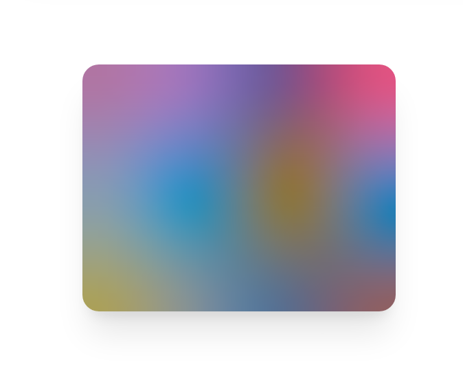

# stimulus-blurhash

A [Hotwire](https://hotwired.dev/) [Stimulus](https://stimulus.hotwired.dev/) controller which uses a [blurhash](https://blurha.sh/) to set the element's background.

<p align="center">
  
  <a href="https://bundlephobia.com/result?p=stimulus-blurhash" rel="nofollow">
    
  </a>
  
  
  
</p>
<br />


## Getting Started

#### Using npm
```bash
npm i stimulus-blurhash @hotwired/stimulus
```

#### Using yarn
```bash
yarn add stimulus-blurhash @hotwired/stimulus
```

## Example

The blur hash `LGF...` in this example is from https://blurha.sh/.

```html
<div class="some-classes" data-controller="blurhash" data-blurhash-blurhash-value="LGF5?xYk^6#M@-5c,1J5@[or[Q6." data-blurhash-x-value="4" data-blurhash-y-value="3">
  <!-- any content here -->
</div>
```
becomes


The screenshot actually uses the classes `m-10 rounded-xl shadow-xl w-3/4 h-3/4` from [tailwindcss](https://tailwindcss.com/).

## Comparison

You can think of `data-controller="blurhash" data-blurhash-blurhash-value="..."` as an alternative to `style="background-image: url('/tiny-version-of-image.png');background-size: 100% 100%`, except that it saves a request.

Or as `style="background-image: url('data:image/png;base64, ...');background-size: 100% 100%"`, except that the blurhash is only ~1% of the size of an equivalent png. You can inspect the element in your browser because the data-url is exactly what this lib generates from the blurhash.

## Documentation

### Usage

Register the controller in your stimulus application:

```js
import { application } from "./application";

import BlurhashController from "./blurhash_controller";
application.register("blurhash", BlurhashController);
```

and then use it with any element:

```html
<div data-controller="blurhash" data-blurhash-blurhash-value="LGF5?xYk^6#M@-5c,1J5@[or[Q6.">
  <!-- any content here -->
</div>
```

Style it any way you want, only background-size and background-color are managed by this library.

<div class="w-96 h-72 flex justify-center items-center text-xl text-white m-10 rounded-xl shadow-xl bg-red-500 bg-blend-difference" data-controller="blurhash" data-blurhash-blurhash-value="LGF5?xYk^6#M@-5c,1J5@[or[Q6.">
  Hello world
</div>

It even works on the document body:

```html
<body data-controller="blurhash" data-blurhash-blurhash-value="LGF5?xYk^6#M@-5c,1J5@[or[Q6.">...</body>
```

### Parameters

* `blurhash: String`, required
* `backgroundSize: String`, default: "100% 100%"
* `punch: Number`, default: 1, increase or decrease contrast/saturation. For a similar effect, you could also set a `background-color` and `background-blend-mode`.
* `x: Number`, default: 32, number of pixel components vertically
* `y: Number`, default: 32, number of pixel components horizontally

## Getting the Blurhash for an image

Getting the blurhash for an image is outside the scope of this library. See [blurhash](https://blurha.sh/) for more information. Rails users may want to check out https://github.com/renchap/shrine-blurhash


## Contributors ✨

Made with :heart: by [@bnjmnbck](https://twitter.com/bnjmnbck)

## Acknowledgments

Thanks to [@adrienpoly](https://twitter.com/adrienpoly) for creating [Stimulus Use](https://github.com/stimulus-use/stimulus-use) which served as inspiration and copy-paste-source for this repo.